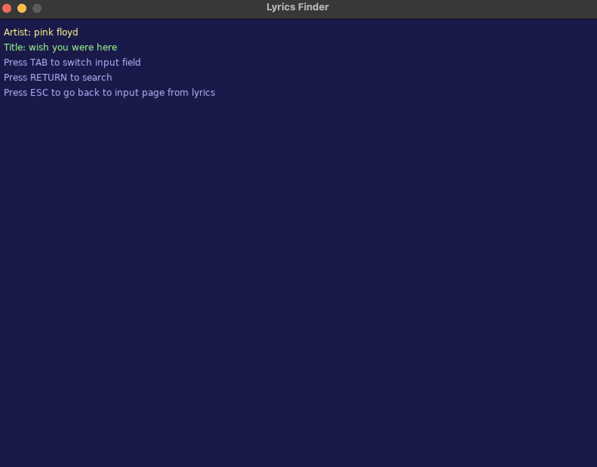
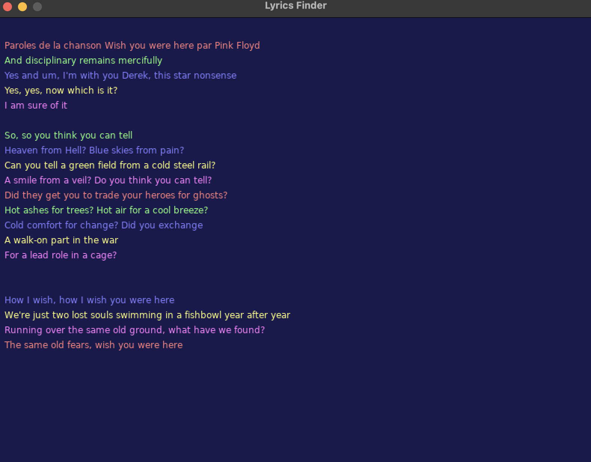

Since i have no idea about lua and modules related to it, don't make any issue about modules cause i have no idea neither.

don't forget to install love2D from https://love2d.org

for calling the API i've used a python script since lua didn't support https requests or at least i don't know how.

also it can detect your spotify current music and automatcally shows the lyrics for the app, just install ```spotify``` via homebrew: 
```bash
brew install --cask spotify
```


### Search artist name and title of the music



### Lyrics preview



### I've added a raindrops effect for simulating your brain
[Watch the rain effect video](resource/rain.mp4)
